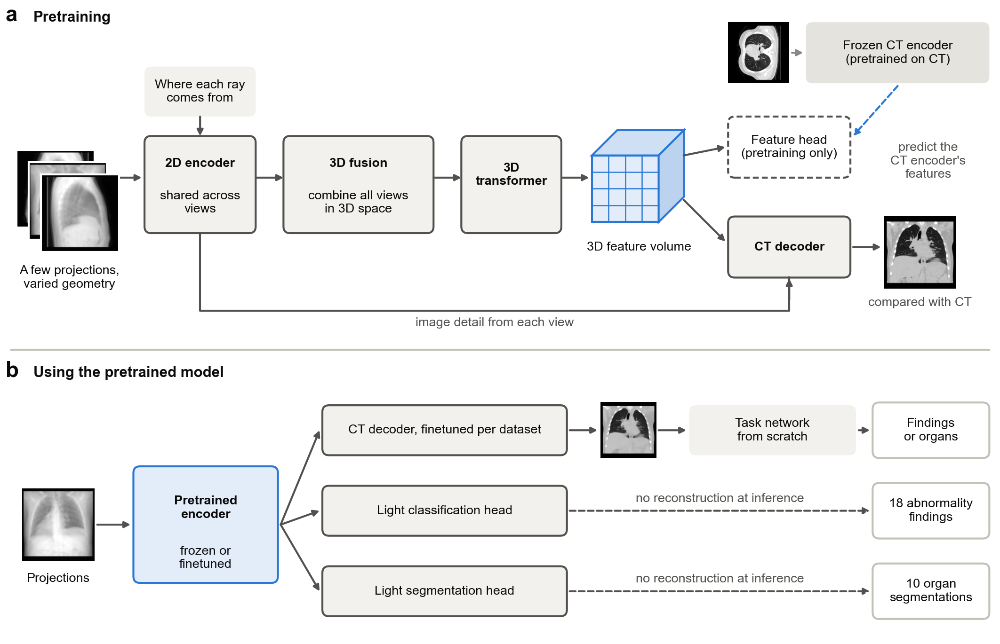

# SPARC: a foundation model for 3D CT reconstruction from sparse X-ray projections

SPARC is a foundation model that reconstructs a three-dimensional CT volume from four or eight X-ray projections. It is pretrained on 47,149 chest CT volumes with randomised acquisition geometry, so its encoder knows where each projection was taken. This repository provides the code, the pretrained weights, the sixteen per-dataset reconstruction models behind the paper's results and the data splits.

[Pretrained weights](https://huggingface.co/lyqun/SPARC) · [Reconstruction models](https://huggingface.co/lyqun/SPARC-reconstruction) · [Data splits](splits/)

**A foundation model recovers three-dimensional anatomy and clinical findings from sparse X-ray projections**
Yiqun Lin, Jiayang Xu, Lie Ju and colleagues · Manuscript (2026)

## Highlights

- One pretrained backbone, adapted to eight CT datasets and three anatomies it never saw in pretraining (head, dental, spine).
- With four or eight projections, SPARC gave the highest PSNR and SSIM in all sixteen dataset and view-count settings against five competing methods retrained under the same protocol.
- Each projection is tagged with the geometry of its rays (Plücker coordinates), so the same model handles different view counts, angles and source-detector distances.
- The paper's reconstruction results on all eight datasets can be reproduced from the released weights by inference alone.



*Figure 1. The SPARC model. Each projection is encoded together with the geometry of its rays, sampled into a 16³ feature volume that a 3D transformer refines, and decoded into Hounsfield units at any query point. During pretraining a second head predicts features of a frozen CT encoder.* [View full-size image](images/method-overview.png)

## Getting started

### 1. Install

```bash
git clone https://github.com/HORIZONHealthcare/SPARC.git
cd SPARC
conda create -n sparc python=3.11 -y
conda activate sparc
pip install torch==2.5.1 --index-url https://download.pytorch.org/whl/cu124
pip install -r requirements.txt
```

### 2. Get model weights and data

| Resource | Link | Use |
|---|---|---|
| Pretrained backbone | [Model card](https://huggingface.co/lyqun/SPARC) · [Checkpoint file](https://huggingface.co/lyqun/SPARC/blob/main/sparc_stage2_backbone.pth) | Starting point for reconstruction on a new dataset |
| Stage-1 CT encoder | [Model card](https://huggingface.co/lyqun/SPARC) · [Checkpoint file](https://huggingface.co/lyqun/SPARC/blob/main/sparc_stage1_ctmae.pth) | Only needed to rerun Stage-2 pretraining |
| Reconstruction models | [Model card](https://huggingface.co/lyqun/SPARC-reconstruction) | Sixteen checkpoints, one per dataset and view count (4 or 8 projections) |
| Data splits | [`splits/`](splits/) | The reconstruction train, validation and test lists used in the paper, after removing test volumes that repeat a training scan |

The weights are released under CC BY-NC 4.0. Fill in the short form on each model page first; access is granted straight away. Then log in with `hf auth login` and download into `weights/`:

```bash
hf download lyqun/SPARC sparc_stage2_backbone.pth --local-dir weights
hf download lyqun/SPARC-reconstruction cq500_v8.pth --local-dir weights
```

The reconstruction models are named `<dataset>_v<views>.pth`, with `<dataset>` one of `ctrate`, `totalsegmentator`, `msd`, `abdomenct1k`, `amos`, `cq500`, `toothfairy3`, `verse`.

The datasets are not redistributed. Download them from their sources; where we used a mirror or a repackaged copy, it is named:

| Dataset | Source | Licence |
|---|---|---|
| CT-RATE (chest; pretraining and chest reconstruction) | [Hugging Face](https://huggingface.co/datasets/ibrahimhamamci/CT-RATE) | CC BY-NC-SA 4.0 |
| TotalSegmentator (v2.0.1, 1,228 CT volumes) | [Zenodo](https://doi.org/10.5281/zenodo.10047292) | CC BY 4.0 |
| Medical Segmentation Decathlon (six CT tasks) | [medicaldecathlon.com](http://medicaldecathlon.com) | CC BY-SA 4.0 |
| AbdomenCT-1K (three image parts) | [GitHub](https://github.com/JunMa11/AbdomenCT-1K) (download form) | see source |
| AMOS 2022 (CT scans only) | [Zenodo](https://doi.org/10.5281/zenodo.7262581) | CC BY 4.0 |
| CQ500 (head) | [qure.ai](http://headctstudy.qure.ai/dataset); we used the [Kaggle mirror](https://www.kaggle.com/datasets/crawford/qureai-headct) | CC BY-NC-SA 4.0 |
| ToothFairy3 (dental CBCT) | [Grand Challenge](https://toothfairy3.grand-challenge.org/dataset/) (registration) | CC BY-NC-SA 4.0 |
| VerSe (spine) | [OSF](https://osf.io/nqjyw/), [OSF](https://osf.io/t98fz/); we used the copy in [CADS](https://huggingface.co/datasets/huggingface/CADS-dataset) (`0010_verse`) | CC BY-SA 4.0 |

#### Data preparation

Convert each dataset with the scripts in `preprocessing/`. [`preprocessing/README.md`](preprocessing/README.md) lists, for every dataset, the files we used and the exact commands. Each volume becomes a zarr array of Hounsfield units (clipped to [-1024, 3071] and stored as int16) with its voxel spacing and body bounding box as attributes. Nothing is resampled at this stage: the data loader crops and resamples each volume to the 256³ grid set in the config and clips it to [-1024, 1024] HU.

Then copy the split files into place with `cp -r splits "$DATA_ROOT/"`. A split lists volumes as `processed/<dataset>/<case>.zarr`, relative to `DATA_ROOT`, which is where the commands in `preprocessing/README.md` write them. [`splits/README.md`](splits/README.md) says how each split was made.

### 3. Reconstruct and evaluate with the released models

```bash
export DATA_ROOT=/path/to/data        # holds splits/ and processed/
export OUTPUT_ROOT=/path/to/outputs
export PYTHONPATH=.
python finetune_foundation_recon.py --config configs/cq500_v8.yaml \
    --init_ckpt weights/sparc_stage2_backbone.pth --eval_ckpt weights/cq500_v8.pth \
    --metrics_manifest "$DATA_ROOT/splits/cq500_test.csv" \
    --metrics_csv cq500_v8_metrics.csv
```

This writes the PSNR and SSIM of every test volume; over the 71 CQ500 test volumes they average 33.06 dB and 0.9689, the values reported in the paper. Replace `--metrics_csv` with `--export_dir <folder>` to save the reconstructed volumes (and their ground truth) as NumPy arrays in Hounsfield units.

Configs and splits are named like the models: the model `<dataset>_v<views>.pth` goes with the config `configs/<dataset>_v<views>.yaml` and the test split `splits/<dataset>_test.csv`. Each view count is a separate model: evaluate a `v8` model with eight projections only.

To adapt SPARC to your own dataset, copy one of these configs, point its manifests at your splits, and train from the pretrained backbone with `--init_ckpt weights/sparc_stage2_backbone.pth` (see below).

### 4. Train

```bash
export DATA_ROOT=/path/to/data        # holds splits/*.csv and the volumes they list
export OUTPUT_ROOT=/path/to/outputs   # checkpoints, logs, metric CSVs
export PYTHONPATH=.
```

Configs address data and runs through `${DATA_ROOT}` and `${OUTPUT_ROOT}`, which
are expanded when a config is loaded. Paths inside a manifest may be absolute or
relative to `DATA_ROOT`.

Pretraining on `splits/ctrate_pretrain.csv` (single node shown; the paper's Stage 2 ran on 16 GPUs, one sample
per GPU, and the learning rate is deliberately **not** scaled with world size):

```bash
torchrun --standalone --nproc_per_node=4 train_ctmae.py      --config configs/stage1_ctmae.yaml
torchrun --standalone --nproc_per_node=4 train_foundation.py --config configs/stage2_backbone.yaml
```

Stage 2 reads the frozen Stage-1 encoder from `target.ctmae_init_path` in its config. To skip
Stage 1, download `sparc_stage1_ctmae.pth` and set that entry to its path.

Reconstruction, one run per dataset and view count, starting from the pretrained backbone
(`--init_ckpt` overrides the `init_ckpt` entry of the config, which points at your own Stage-2 run):

```bash
python finetune_foundation_recon.py --config configs/cq500_v8.yaml \
    --init_ckpt weights/sparc_stage2_backbone.pth
```

There is one config per dataset and view count, `configs/<dataset>_v{4,8}.yaml`. Each view count is a
separate model: a `v8` checkpoint is never evaluated at `V=4`.

Every reconstruction config runs a fixed protocol: at most 400 epochs, early
stopping on held-out validation PSNR (minimum 120 epochs, then five consecutive
validations without a 0.02 dB improvement), validating every 20 epochs, and the
best-validation checkpoint is the one evaluated on test.

To evaluate a finished run on its test split and write per-volume PSNR and SSIM:

```bash
python finetune_foundation_recon.py --config configs/cq500_v8.yaml \
    --eval_ckpt best.pt \
    --metrics_manifest $DATA_ROOT/splits/cq500_test.csv \
    --metrics_csv $OUTPUT_ROOT/cq500_v8/test_metrics.csv
```

## Environment and hardware

| Component | Version or requirement |
|---|---|
| Python | 3.11 |
| Framework | PyTorch 2.5.1; nanodrr 0.1.4; see `requirements.txt` |
| CUDA / CPU | CUDA 12.4 |
| Hardware and GPU memory | Inference: one GPU with at least 8 GB (peak 5.7 GiB at a 256³ output grid, about 4 s per volume on an NVIDIA GH200). Training: the paper's models were trained on NVIDIA GH200 GPUs (96 GB); Stage 2 used 16 GPUs with one volume each, and per-dataset reconstruction used one GPU with three volumes per step. |

## Repository layout

```
src/models/foundation.py         SparseViewFoundation: one backbone, two heads
src/models/xray_encoder_2d.py    per-view ConvNeXt pyramid + Plucker injection
src/models/feature_volume_3d.py  projection, max-fuse, 3D transformer -> F
src/models/point_decoder.py      implicit point decoder (resolution-free)
src/models/ct_mae.py             Stage-1 3D masked autoencoder
src/datasets/drr_dataset.py      CT loading and acquisition geometry
src/utils/nanodrr_helpers.py     differentiable DRR rendering and ray geometry
src/utils/plucker.py             Plucker ray maths
src/utils/project_paths.py       ${DATA_ROOT} / ${OUTPUT_ROOT} resolution

preprocessing/                   CT volumes -> per-volume zarr (see preprocessing/README.md)

train_ctmae.py                   Stage 1
train_foundation.py              Stage 2
finetune_foundation_recon.py     Stage 3, reconstruction
```

## Notes on scope

This repository contains SPARC only. The baseline reconstructors we compare
against (DIF-Net, C2RV, DIF-Gaussian, SVCT, DeepSparse) are third-party code and
are not redistributed here; please obtain them from their original authors. Where
our modules build on ideas from those works - notably the projection-and-sample
lifting and the point decoder, which follow DeepSparse - the source is noted in
the file headers.

## Citation

If you use this code, the weights or the splits, please cite:

```bibtex
@misc{lin2026sparc,
  title  = {A foundation model recovers three-dimensional anatomy and clinical findings from sparse X-ray projections},
  author = {Lin, Yiqun and Xu, Jiayang and Ju, Lie and Wang, Hualiang and Guo, Jiarong and Yao, Huifeng and Sun, Haoran and Zhou, Yukun},
  year   = {2026},
  note   = {Manuscript}
}
```

Please also cite the datasets you use (see the table above).

## Contact

For research enquiries, contact [Yukun Zhou](mailto:yukun.zhou.19@ucl.ac.uk) or [Yiqun Lin](mailto:yiqun.lin@ucl.ac.uk).

## License

The code, documentation and model weights are released under [CC BY-NC 4.0](LICENSE). Use of the weights must also respect the terms of the dataset each model was trained on. The models are for research use only and are not medical devices.
